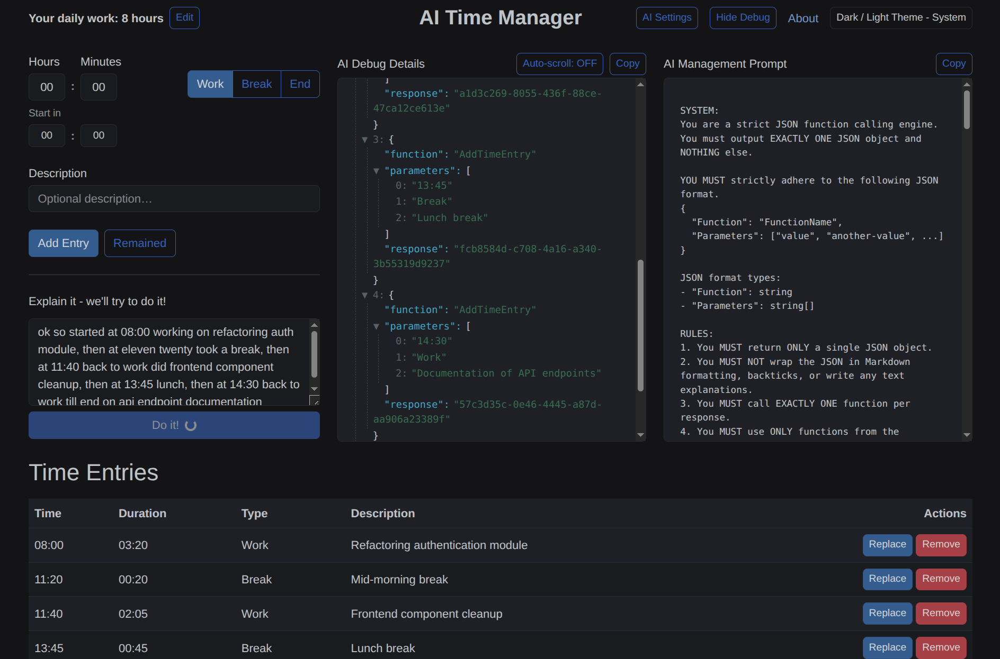

# AI Time Manager

### AI-powered Time Data Management with deterministic LLM function calling  

### 🎬 YouTube Video Demo: https://youtu.be/ZoJmzfI-muc

---

- Runs locally using **Ollama (gemma4:e4b)**
- Uses custom AIOrchestrator NuGet package:
[](https://www.nuget.org/packages/AIOrchestrator)
[](https://github.com/notNullThen/ai-orchestrator-dotnet)

---



---

## 🚀 Overview

This project demonstrates a different approach to AI integration:

👉 The LLM does not generate free-form responses  
👉 It **decides which function to call**

The system converts messy, natural user input into structured time tracking data through **strict JSON-based function calling**.

---

## Setup & First run

The AI features are powered by [Ollama](https://ollama.com/). By default, it expects the `gemma4:e4b` model, but it can be changed via **AI Settings** button.

1.  **Install Ollama:** Follow instructions at [ollama.com](https://ollama.com/).
2.  **Pull the model:**
    ```bash
    ollama pull gemma4:e4b
    ```
3.  **Run the application**

## Run

### Standard run (recommended):
```bash
dotnet run --project TimeCalculator
```

### Run with network access (accessible from other devices, doesn't support AI yet):
```bash
dotnet run --project TimeCalculator --urls "http://0.0.0.0:8080"
```

### Run with Docker Compose (doesn't support AI yet):
```bash
docker compose up --build
```

---

## 🧠 Key Idea

Instead of chat-based AI:

> **LLM → decides action → C# executes logic**

Example input:
```
ok so started at 08:00 working on refactoring auth module, then at eleven twenty took a break...
```

👉 Output:
- Structured time entries  
- Correct timestamps  
- Clean, professional descriptions  

---

## ⚙️ Architecture

```
Blazor Web UI
        ↓
AIOrchestrator (NuGet)
        ↓
Ollama (local runtime)
        ↓
Gemma 4 (e4b model)
```

---

## 🔧 How AI Works

The LLM operates as a **strict JSON function-calling engine**.

Available functions:
- `AddTimeEntry(time, type, description)`
- `ReplaceEntry(guid, time, type, description)`
- `EndTheDay()`

### Execution flow:
1. User provides messy natural input  
2. LLM evaluates current state (time table + history)  
3. LLM selects **exactly one function**  
4. Backend executes it  
5. Context updates  
6. Process repeats until `Exit`

---


## 🔄 Context Awareness Example

After completing the workflow, the system can handle updates like:

> "please replace frontend cleanup with optimization"

👉 The LLM:
- Finds the correct entry  
- Uses its ID  
- Calls `ReplaceEntry(...)` with updated description